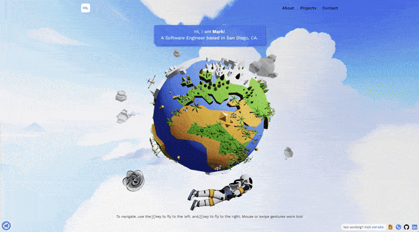

### Hi There! 

Please checkout my [portfolio](https://marklucernas.com/) for more information about me.

<!-- Image resize: https://gist.github.com/uupaa/f77d2bcf4dc7a294d109 -->

<!-- 🔭 **I’m currently working on:** -->
<!--   -->
<!--   -->

🏫 **I'm currently in:** College pursuing a Computer Science Degree 
🌱 **I’m currently learning:** Computer Networking 
📚 **I’m currently reading:** _Algorithms to Live By_ by Brian Christian and Tom Griffiths 
⚡ **Fun fact:** My very first program was a mini search engine in my [Excel Trading Spreadsheet](./resources/2019_PaperMoney_TradingSpreadsheet.xlsm) 

### Connect With Me

- [🌎 marklucernas.com](https://marklucernas.com/)
- [📄 CV / Résumé](https://marklucernas.com/#/resume)

<!-- Badges: https://shields.io/ -->

  More stuff about me...

 

I am an avid [Neovim](https://github.com/marklcrns/nvim-config) text editor
user who swing trade stocks on the side. I also love playing guitar, reading
psychology books, and hiking.

Please check out my [Zettelkasten](https://marklucernas.dev/)--some form of
personal blog inspired by Niklas Luhmman.

#### Github Stats

<!-- Stats: https://github.com/anuraghazra/github-readme-stats -->

<!-- Alternative -->
<!--  -->
<!--                                                               -->

